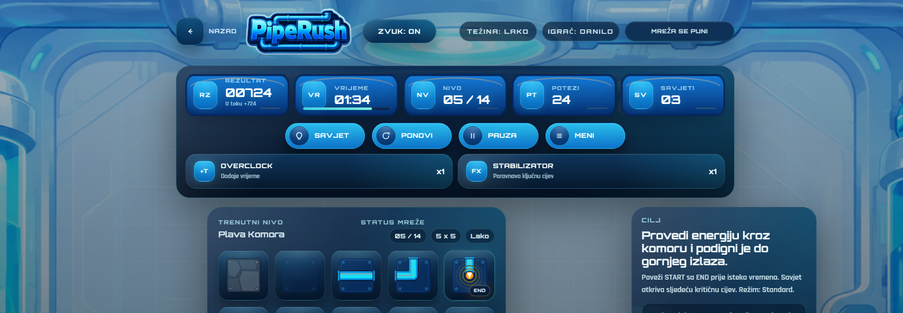
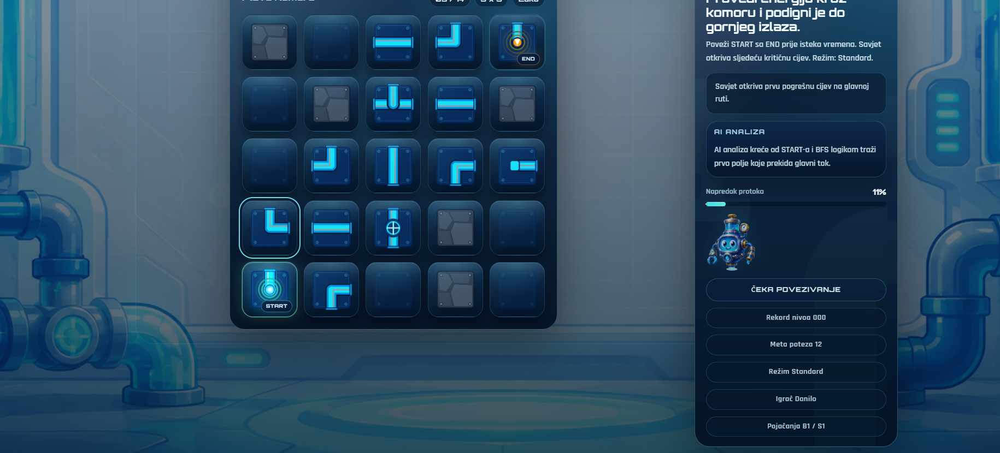
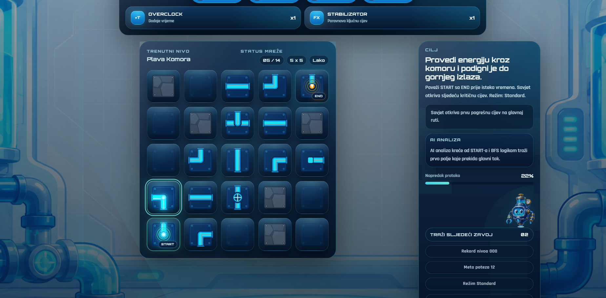

# PipeRush

PipeRush je inovirana verzija klasične puzzle igre tipa `Pipeline`. Cilj igrača je da rotiranjem cijevi poveže `ULAZ` sa `IZLAZOM` prije isteka vremena i tako stabilizuje mrežu. Projekat je razvijen kao studentska tema iz računarske grafike, sa novim vizuelnim identitetom, AI-generisanim artom, kampanjom sa nivoima težine, boss nivoima, power-up sistemom, rang listom i lokalnim čuvanjem progresa.

## Predajni sažetak

- Tema: `Pipeline`
- Repozitorijum: [https://github.com/programernaaparate/Piperush](https://github.com/programernaaparate/Piperush)
- Promo materijal: kratki promo video `15–30s` je pripremljen kao zaseban fajl za predaju
- Tehnologije: `React`, `Vite`, `JavaScript`, `CSS`, `localStorage`

## Opis igre

U igri PipeRush igrač dobija mrežu cijevi koje su djelimično pogrešno orijentisane. Klikom na cijevi mijenja njihovu rotaciju i pokušava da napravi ispravan tok energije od početne do završne tačke. Svaki nivo ima vremensko ograničenje, cilj u broju poteza i ograničen broj savjeta. Što je igrač brži i precizniji, to dobija bolji rezultat i više medalja.

Osnovna mehanika je inspirisana originalnom igrom Pipeline, ali je kompletno prenesena u moderni futuristički kontekst. Umjesto jednostavne klasične table, PipeRush koristi neon-industrijski interfejs, animirani tok energije, više režima težine i posebne prepreke koje mijenjaju način igranja.

## Inovacije u odnosu na original

U odnosu na osnovnu Pipeline ideju, PipeRush uvodi više slojeva gameplay-a i prezentacije:

- `3` pune kampanje težine: `Lako`, `Srednje`, `Teško`
- ukupno `42` kampanjska nivoa, plus `1` dnevni izazov
- `4` boss nivoa, uključujući `1` ultra završnicu
- posebne mehanike polja:
  - zaključane cijevi
  - rotorske cijevi
  - oštećene cijevi
- power-up sistem:
  - `Ubrzanje` dodaje vrijeme
  - `Stabilizator` automatski poravnava ključnu cijev
- sistem savjeta zasnovan na analizi glavne rute
- dnevni izazov
- lokalna rang lista
- čuvanje progresa i imena igrača između sesija
- boss događaji koji mijenjaju tok partije tokom igranja

Na taj način igra nije samo kopija originala, već proširena i modernizovana verzija sa jačim identitetom, većom replay vrednošću i većim brojem mehanika.

## Novi vizuelni identitet

Vizuelni identitet igre je potpuno nov i razvijen uz pomoć AI alata. U projektu su osmišljeni:

- logo igre `PipeRush`
- sprites i ilustracije pomoćnih i boss likova
- kompletan UI stil panela, dugmadi i modala
- futurističke pozadine za meni, obične nivoe i boss nivoe
- specijalni vizuelni prikazi za ultra završnicu

Likovni stil kombinuje `cyber-industrial` estetiku, sjajne plave cijevi, neon glow efekte i tamne tehničke pozadine. Cilj je bio da igra odmah izgleda kao nova i autorska verzija Pipeline ideje.

## AI zvuk i muzika

Audio sistem uključuje:

- pozadinsku muziku za igru
- zvučne efekte za klik, rotaciju, upozorenja, savjet i završetak nivoa
- rezervni sintetički sistem efekata ako neki spoljašnji fajl nije dostupan

Ovim je obezbijeđeno da igra i u prezentaciji ima kompletniji audiovizuelni identitet.

## Upotreba AI asistenta

Tokom razvoja korišćen je AI asistent za:

- generisanje djelova koda
- pomoć pri debagovanju gameplay i UI problema
- ideje za raspored nivoa i sistem težine
- doradu tekstova, opisa i UX toka
- planiranje vizuelnog identiteta i prezentacije

Korišćeni AI alati i pristupi:

- `ChatGPT / Codex` za kod, debugging i refaktorisanje
- AI image alati za logo, sprites, UI ilustracije i pozadine
- AI video alat za promo video

Ako si za slike ili promo video koristio konkretan alat kao `Canva`, `Sora`, `Nano Banana` ili drugi, isti naziv navedi i u usmenoj prezentaciji.

## Screenshotovi igre

### Gameplay sa HUD-om



### Tabla i glavni tok



### Desni status panel i cilj nivoa



## Pokretanje projekta

```powershell
npm install
npm run dev
```

Za produkcioni build:

```powershell
npm run build
```

## Struktura projekta

Najvažniji fajlovi:

- `src/components/MainMenu.jsx`
- `src/components/GameScreen.jsx`
- `src/components/GameBoard.jsx`
- `src/components/Tile.jsx`
- `src/components/HUD.jsx`
- `src/components/LevelSelectModal.jsx`
- `src/components/LeaderboardModal.jsx`
- `src/components/LevelCompleteModal.jsx`
- `src/components/GameOverModal.jsx`
- `src/data/levels.js`
- `src/utils/pipeLogic.js`
- `src/utils/audio.js`
- `src/utils/progress.js`

## Napomena za predaju

Uz repozitorijum i sam projekat potrebno je predati:

- promo video
- kratku prezentaciju
- opis igre i inovacija
- navedene AI alate
- screenshotove igre

Za to su u projektu pripremljeni i fajlovi:

- [PREDAJA.md](./PREDAJA.md)
- [PRESENTATION.md](./PRESENTATION.md)
